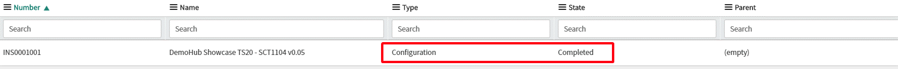
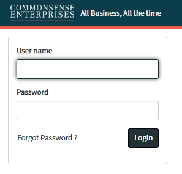
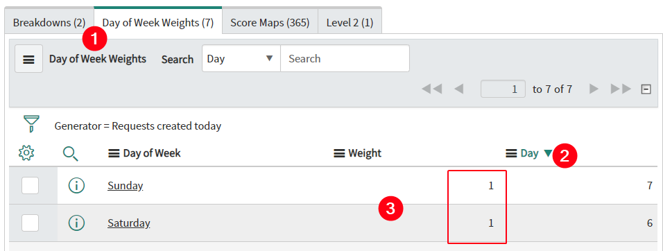
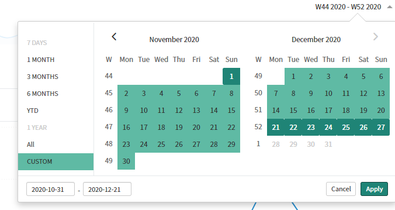
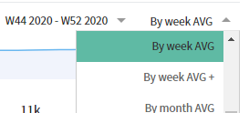

# DemoHub App

## Getting Content

This section will review how to use the new DemoHub App to deploy
content to your instance.

### Narrative Documents

*Narratives* are the documented steps someone takes during a demo to
showcase a specific outcome or product. All the information needed to
demo a *Narrative* is available in the *Narrative Document*. We can see
all the required configurations that need to be installed so the
*Narrative* can be followed during a demo. Additional details, a
click-through .pptx, and walkthrough videos may also be associated with
the record.

1)  To get the latest content, navigate to **(DemoHub App \> Console)**\
    \
    

2)  From here you can see an overview of the available DemoHub content.
    Click **DemoHub Sync** to fetch the latest content from the server.\
    \
    

3)  After the sync completes, it will return us to the DemoHub Console.
    We can see one Narrative is available for this release. Click on the
    **Narratives pie chart**.\
    \
    

4)  **Open** the \<DemoHub Product Template\>. Attached to the record is
    DemoHub Orlando Narrative Template.docx.
    
    > "NOTE:" If the attachment count does not match the number of
    attachments, delete the record and run a DemoHub sync again.
    
    

### Installing Configurations

The configuration record contains all the technical instructions applied
to an instance so a Narrative can be followed.

1)  Navigate to **(DemoHub App \> Console \> Available Showcases)**.
    From here you can see all the different configurations showcased by
    BU. In this lab we only have one Showcase available.\
    \
    

2)  **Open** the \<DemoHub Showcase TS20 - SCT1104\> record.

3)  Review the different Related Lists to see how this configuration will affect this instance.
 
    
    
    > "NOTE: " Configurations are applied in the following order:
    Plugins \> OOB/True-up Store Applications \> Store Applications \>
    Update Sets \> XML \> Scripts \> Included Configurations

4)  Click **Install** to queue the configuration.\
    \
    

5)  You will be redirected to the Install Queue **(DemoHub App \>
    Install Queue)**. From here you can monitor the progress. Plugins
    and Store Apps that are already installed will show as **Completed**
    with an **Install Time** of **0 Seconds**.\
    \
    

6)  Refresh the page until the **Configuration** shows as
    **Completed**.\
    \
    

7)  Refresh the browser window. You will see the Logo and Banner Text
    updated to **TechSummit 2019**.\
    \
    

> This is the wrong banner text. We will need a patch to fix the text.

### Applying Patches

Navigate to **(DemoHub App \> Console)** and **Install** the available
patch. After the patch completes, refresh the page to see the updated
Banner text of **TechSummit 2020**.\
\

### Manually Applying Configuration Components

With the new DemoHub App, you can manually apply Update Sets, XMLs, and
scripts without installing the entire configuration. Update sets store
configuration information and XMLs store record demo data. This makes
resetting an instance easy.

1)  Navigate to **(System Properties \> My Company)**.

2)  **Delete** the \<UI16 Banner Image\> and **refresh** the page. This
    will revert the logo to *servicenow*.\
    \
    

3)  Navigate to **(DemoHub App \> Console)** and **Installed
    Showcases**. This will show you all the BU configurations installed
    on the Instance. **Open** the \<DemoHub Showcase TS20 - SCT1104\>
    record.

4)  Navigate to the **XMLs** related list. Check the box for the
    \<core\_company\_\...\> record and click **Install XML**.    
    
    
    > NOTE:  The DemoHub App can manually install Update Sets, XMLs, and
    run scripts.
     

    
    
    

5)  After the install completes, refresh the page to see the updated
    logo.\
    \
    

# Branding your Instance

## Commonsense Enterprises

In this section of the lab, we will look at how to skin your instance to
match your customer's branding. We will use the follow logo and color
values. Feel free to use one of your customers instead.

### Logos

Ideally, logos are transparent with light lettering. This allows the
logo to sit against a dark banner background. Logos cannot be more than
32px by 230px.\
\
"Additional Info:" [Community Guide on Banner
images](https://community.servicenow.com/community?id=community_blog&sys_id=9b1ea26ddbd0dbc01dcaf3231f961907)

Logo:\
\
\

Light Logo:

 
Transparent:

No Icon:

Icon:\
\

Colors

Grab the color HEX values from a public facing website or directly from
the logo. Use a site like <https://coolors.co/> to generate
complementing colors.

Given:

-   \#FDF8FA (snow)

-   \#EF5B4D (tomato)

-   \#0B3C49 (warm black)

Generated:

-   \#071E22 (dark jungle green)

-   \#1D7874 (myrtle green)

-   \#B4B8AB (ash grey)

-   \#153243 (yankees blue)

## UI16

In this section of the lab, we will look at how to skin the platform UI
using the DemoHub Theme Generator.

### Create a New Theme

1)  Gather your logo and 5-8 colors.

2)  Navigate to **(DemoHub Theme Generator \> Create UI16 Theme).**

3)  Select the **gear icon** in the top right corner.\
    \
    

4)  Set the following values:\
    \
    *Theme name* **Commonsense Enterprises**\
    *Banner frame background (\$navpage-header-bg)* **\#0B3C49**\
    *Banner frame title text and Global Search (\$navpage-header-color)*
    **\#FDF8FA** *\
    Name and Connect,Help,Settings icons
    (\$navpage-header-button-color)* **\#FDF8FA**\
    *Header divider (\$navpage-header-divider-color)* **\#EF5B4D** *\
    Navpage outlines (\$navpage-nav-border)* **\#B4B8AB** *\
    Search text color (\$search-text-color)* **\#FDF8FA**\
    *Nav background (\$navpage-nav-bg)* **\#0B3C49**\
    *Background navigator and sidebars (\$navpage-nav-bg-sub)*
    **\#0B3C49**\
    *Subnav background color (\$subnav-background-color)* **\#153243**\
    *Textcolor navigator sub (\$navpage-nav-color-sub)* **\#FDF8FA**\
    *Navigator app textcolor (\$navpage-nav-app-text)* **\#FDF8FA**\
    *Navigator highlight bar active (\$nav-highlight-bar-active)*
    **\#1D7874**\
    *Navigator currently selected Navigator tab
    (\$navpage-nav-selected-bg)* **\#153243**\
    *Navigator highlight bar inactive (\$nav-highlight-bar-inactive)*
    **\#213234**\
    *Color accent (\$color-accent)* **\#213234**\
    *Icon seleced color (\$navpage-nav-selected-color)* **\#EF5B4D** *\
    *Icon unseleced color (\$navpage-nav-unselected-color)*
    **\#FDF8FA***\
    *Separator modules and vertical lines(\$nav-hr-color)* **\#FDF8FA**\
    *Button color(\$navpage-button-color)* **\#FDF8FA**
    
    > "Note:" The colors will update in real-time to simulate what the
    Platform UI will look like. Feel free to experiment with different
    colors and values.
    

    

5)  Click **Create theme**.
    
     > "Note:" You can edit the theme by navigating to **(DemoHub Theme
    Generator \> Themes).**

### Setting a Theme as Default

Now we want to set the theme to the default for all users.

1)  Navigate to **(DemoHub Theme Generator \> Default Theme)** and open
    the record.

2)  Set the value to the name of the theme we just created, Commonsense
    Enterprises, and **Update**.\
    \
    

3)  Remove the *condition* **User is empty** from the breadcrumbs.
    Delete any records assigned to a user leaving only the one for
    (empty).\
    \
    \
    \
    

4)  Navigate to **(System Properties \> My Company).**

5)  Upload the following image into *UI16 Banner Image.*
    
    

6)  Set the *Theme* to **Commonsense Enterprises** and *Banner text* to
    **All Business, All the time**. **Update**.\
    \
    

7)  In the *Filter Navigator*, type **cache.do** and hit enter.\
    \
    

8)  **Logout** and then **login**. You should see the new theme and
    logo.\
    \
    \
    \
    

## Agent Workspace

The following section requires an Orlando instance and will not be
available to complete during SKO20.\
\
How to skin the Agent Workspace to match your customer.

1)  Change your scope to the **Agent Workspace** application.

2)  Navigate to **(Workspace Experience \> Administration \> All
    Workspaces** and open the **Agent Workspace** record.

3)  Set *Brand color 1* to **\#0B3C49**, *Brand color 2* to
    **\#EF5B4D**, and *Description* to **All Business, All the time**.

4)  Upload the following logo into *Custom Logo*.\
    \
    

5)  View the branding by clicking the **Open Workspace ➚** Related
    Link.\
    \
    

## Virtual Agent

The following section requires an Orlando instance and will not be
available to complete during SKO20.\
\
How to skin the Virtual Agent to match your customer. Requires Orlando.

1)  Navigate to **(Collaboration \> Branding Setup)** and open the
    **Default Branding** record.

2)  Set the colors to match your theme and **Save**.

3)  Upload the **Icon** to the *Chat Header Logo*.\
    \
    \
    \
    \
    

# GDPR Personal Data Erasure Request App

## Using the GDPR App

For the rest of this lab, you will use a custom application to learn how
to use the DemoHub tools to support the story you want to tell.

1)  Navigate to **(GDPR Personal Data Erasure Request \> Submit
    Request)**. A new window will open.

2)  Complete the form and **Submit**.\
    \
    

3)  After a few seconds, the *Short Description* and *Customer* will
    auto-populate. Once the *Customer* field is populated, change the
    *State* to **Work in Progress, right click** on the *banner*,
    and **Save**. This will kick off a flow to create the Subtasks.\
    \
     
    
    >"Note:" If you navigate away from the record, you can find the list
    of requests by Navigating to **(GDPR Personal Data Erasure
    Request \> Open Requests).**

4)  Assign **Fred Luddy** to the Request and **Save**.\
    \
    

5)  **Refresh** the record until you see Subtasks in the related list.
    **Sort** the list by *Priority*.\
    \
    \
     

6)  **Open** the Subtask to Erase data for **SAP Payroll**.\
    \
    

7)  To Approve the request, **right click** on one of the Approval
    records and select **Approve**.\
    \
    

8)  Change the state to **Closed Complete** and **Update** to return to
    the parent Request.\
    \
    

9)  **Open** the Subtask to Erase data for **E-Commerce**.\
    \
    

10) Navigate to the **Subtasks** related list and **Close Complete** the
    Subtasks.\
    \
    

11) The *State* will automatically change to **Closed Complete**.
    Navigate back to the parent **Request**.

12) **Close Complete** all the other Subtasks.\
    \
     

13) The Request will automatically change its state to **Closed
    Complete**.\
    \
     

14) Change the *State* to **Pending** and **Update**. We will use this
    later in the lab.

This is the basics of the GDPR Personal Data Erasure Request
application. We will now use the application to learn how to use the
Narrative Jump and PA Data Generator the tools.

# Narrative Jump

## Setup the Flow

The Narrative Jump will execute a Flow to simulate people actions taken
against a process. This will not replace the existing Workflow for an
application but sit on-top for demo purposes. We need to first create a
flow to simulate working the *GDPR Personal Data Erasure Request*
Application.

1)  Navigate to **(System Update Sets \> Local Update Sets)** and click
    **New**.

2)  Set the *Name* to **GDPR Narrative Jumps** then **Submit and Make
    Current**.

3)  Navigate to **(Flow Designer \> Designer).** A new window will open.

4)  Click **(+ New \> Flow)**.\
    \
     

5)  Give the Flow a *Name* of **Work E-Commerce Subtasks**. **Submit**.\
    \
    

6)  Click **(+ Select** **to add a Trigger \> Record \> Created or
    Updated)**.

7)  In the *Table* field, search for **GDPR** and select **Request
    \[x\_snc\_gdpr\_erase\_request\]**.\
    \
     

8)  We want to use the flow in the Narrative Jump but only want it to
    run when we explicitly call the flow. To prevent the flow from
    running on its own, set the *Condition* to **\[Sys ID\] \[is\]
    \[123\]**. Since a *Sys ID* is never *123*, this flow will not run
    unless we call via the *Narrative Jump* tool.
    \
    

9)  Click **Done**.

10) Click **Save**.\
    \
         
    >"Note:" Make sure to save frequently when building the flow.

### Kick off the existing workflow and wait

The first thing we need to simulate is the setting of the *State* to
*Work in Progress*. This will kick off the OOB flow to create Subtasks.
Once the workflow starts creating Subtasks, we need to wait for the
E-Commerce subtask to be created. Actions 1 and 2 will jump over setting
the *State* then waiting for the E-Commerce Subtask to be created.

1)  Click **(+ Select to add an Action, Flow Logic, or Subflow \>
    Action \> ServiceNow Core \> Update Record)**.

2)  Set the *Record* to **(Trigger -\> Request Record)**.\
    \
    

3)  Set the *Fields* to **\[State\]** **\[Work in Progress\] AND \[Work
    notes\] \[Starting work.\] AND \[Assigned to\] \[Fred Luddy\].**\
    \
     

4)  Click **Done**.

5)  We need to force the Flow to wait for other processes to complete.
    We can use a *Do the following until* action to check if there are
    any Subtasks assigned to the E-Commerce Subtask. Click **(+ Select
    to add an Action, Flow Logic, or Subflow \> Flow Logic \> Do the
    following until)**.

6)  Click the **+** under *Do the following*.\
    \
     

7)  Click **(Action \> ServiceNow Core \> Lookup Records)**.
    
    > "Note:" Select **Lookup Records**, plural.

8)  In the *Table* field, search for **GDPR** and select **Subtask
    \[x\_snc\_gdpr\_erase\_subtask\]**.\
    \
     

9)  Set the *Conditions* to **\[Parent.Parent\] \[is\] \[(Trigger -\>
    Request Record)\]** **AND** **\[Configuration item\] \[is\]
    E-Commerce\]**.\
    \
     \
    \
     \
    \
     
10) Click **Done**.

11) Click the **+** under *Lookup Subtask Records*.\
    \
     

12) We need to slow the *Look Up* action down a little or the Flow
    engine will process all 1000 attempts in a second or two. If we add
    a 1 second wait, that will give the other flows enough time to run.
    Click **(Flow Logic \> Wait for a duration of time)**.

13) Set *Wait for* to **1 second**. Click **Done**.\
    \
    

14) Click **until (these conditions are met)**.\
    \
     

15) Set the *Condition* to **\[(2.1 -\> Count)\] \[greater than\]
    \[0\]**.\
    \
     \
    \
    

16) Click **Done**.

17) Click **Save**.\
    \
    

### Update the Subtasks

Now that we verified the E-Commerce Subtasks were created, we need to
assign them to the Software team. After assignment, we need to close
each of the Subtask's Subtasks. Actions 3-6 will jump over navigating to
each of the three E-Commerce Subtasks and updating them.

1)  Click **(+Select to add an Action, Flow Logic, or Subflow \>
    Action \> ServiceNow Core \> Lookup Record)**.
    
    >"Note:" Select **Lookup Record**, singular.

2)  In the *Table* field, search for **GDPR** and select **Subtask
    \[x\_snc\_gdpr\_erase\_subtask\]**.\
    \
     

3)  Set the *Conditions* to **\[Parent\] \[is\] \[(Trigger -\> Request
    Record)\]** **AND** **\[Configuration item\] \[is\] E-Commerce\]**.\
    \
     \
    \
     

4)  Click **(+Select to add an Action, Flow Logic, or Subflow \>
    Action \> ServiceNow Core \> Update Record)**.

5)  Set the *Record* to **(3 -\> Subtask Record)**.\
    \
     

6)  Set the *Fields* to **\[Work notes\] \[Assigning to Software team.\]
    AND** **\[Assignment group\] \[Software\]**. Click **Done**.\
    \
     

7)  Click **(+Select to add an Action, Flow Logic, or Subflow \>
    Action \> ServiceNow Core \> Lookup Records)**.
    
    > "Note:" Select **Lookup Records**, plural.

8)  In *Table* search for GDPR then select **Subtask
    \[x\_snc\_gdpr\_erase\_subtask\]**.\
    \
     

9)  Set the *Conditions* to **\[Parent.Parent\] \[is\] \[(Trigger -\>
    Request Record)\]** **AND** **\[Configuration item\] \[is\]
    E-Commerce\]**.\
    \
    \
    \
     \
    \
     

10) Click **Done**.

11) Click **(Select to add an Action, Flow Logic, or Subflow \> Flow
    Logic \> For Each)**.

12) Set the Items to **(5 -\> Subtask Records)**. **Done**.\
    \
    

13) Click the **+** under For Each Item in **(5 -\> Subtask Records).**

14) Click **(Select to add an Action, Flow Logic, or Subflow \>
    Action \> ServiceNow Core \> Update Record)**.

15) Set the *Record* to **(6-\> Subtask Record)** and **(Subtask
    \[x\_snc\_gdpr\_erase\_subtask\])** will auto populate the *Table*.

16) Set the *Fields* to **\[Work notes\] \[Task complete.\] AND**
    **\[State\] \[Closed Complete\]**. Click **Done**.\
    \
     

17) Click **Save**.\
    \
     

### Update the Request

At this point, we have closed the E-Commerce Subtasks with notes. If we
need to navigate into one of the Subtasks, we will see all the proper
values assigned and the activity log of people making updates. We now
need to update the parent Request record to let the person doing the
demo know the jump is complete.

1)  Click **(+ Select to add an Action, Flow Logic, or Subflow \>
    Action \> ServiceNow Core \> Update Record)**.

2)  Set the *Record* to **(Trigger -\> Request Record)** and **(Request
    \[x\_snc\_gdpr\_erase\_request\])** will auto populate the *Table*.

3)  Set the *Fields* to **\[Work notes\] \[Customer removed from
    E-Commerce.\]**. Click **Done**.\
    \
     

4)  Your flow should look like this:\
    \
     

18) Click **Activate**.\
    \
    

### Testing the Flow

We now need to test the flow. Let's create a new Request and verify the
Flow works before assigning it to a Jump.

1)  Create a new **Request**. You will be returned to the *Request*
    record.\
    \
     \
    \
    

2)  Wait for the *Customer* and *Short Description* fields to auto
    populate then **copy** the *Number*.\
    \
     

3)  Navigate back to the Flow in *Flow Designer* and click **Test**. Run
    a test against the Request you just created by pasting the *Number*
    into the *Request Record* field. Click **Flow has been executed. To
    view the flow, click here**.\
    \
     

4)  You should see all the steps finish with a *State* of *Completed*.
    If the test is still running, click the **refresh button** next to
    *Test Run -- Waiting*.\
    \
    \
    \
    

5)  Click **Open Current Record \> Open Record**. You should see the
    *Subtask for E-Commerce* change to a *State* of *Closed Complete*.\
    \
    
### Narrative Jump

In this exercise we will learn how to create the Narrative Jump record
so we can execute the Flow we just created when we want. In this use
case, we want to simulate updating the E-Commerce Subtasks and closing
them out. This will allow us to talk about the features of the Request
record then jump to working with closed Subtasks.

1)  Navigate to **(DemoHub Narrative Jump \> Jump Configurations)** and
    click **New**.

2)  Set the following values and **Save**:\
    \
    *Name*: **Work E-Commerce Subtasks**\
    *Flow*: **Work E-Commerce Subtasks**\
    **Table*: **Request \[x\_snc\_gdpr\_erase\_request\]**\
    Filter*: **\[State\] \[is\] \[Open\]**\
    Active: **true**\
    \
     
    

3)  Create a new Request and wait for the *Customer* and *Short
    Description* fields to auto populate.

4)  Click the UI Action **Execute Jump**.\
    \
    

5)  You will be presented with a list of available Jumps for this
    record. Click **Activate Jump** for *Work E-Commerce Subtasks*.\
    \
     

6)  A notification will confirm your selection.\
    \
     

7)  Since we updated a field being tracked in the Activity feed, we
    don't need to refresh the page to see if the Jump completed.
    Navigate to the *Activity* tab. From here updates show in the feed.
    Wait for the message *Customer removed from E-Commerce* then
    **refresh** the page.\
    \
    

8)  The E-Commerce Subtasks will change to Closed Complete. Navigate
    into the **Subtasks** and you will see the *Assignment Group* and
    *Work notes* updated.\
    \
     

This now allows us to create a new record then "jump" into the middle of
work. We can show the Subtask for E-Commerce has already been updated
and can demo how ServiceNow allows many people in an organization to
collaborate. Stopping a narrative to navigate and fill out forms can
detract from the message. Narrative Jump allows you to skip over the
parts of a process that are not important to show in a demo.

### Challenge

Create another Jump to close the remaining Subtasks. Don't forget to
Approve the Subtask for SAP Payroll before closing it. The first
walkthrough of the GDPR Personal Data Erasure Request app took 15-20
clicks. Let's see how many clicks you can reduce it to while still
showing the value of the app.\
\

### Complete the Update Set

Once you are complete with the Narrative Jump, navigate to the Update
Set record and change the state to Complete. You can export to xml if
you want share with another instance or keep for later.

# Creating Performance Analytics Data

## Generators

The DemoHub PA Data Generator tool uses Generators to create scores for
PA Indicators. The Generator record has a 1 to 1 relationship with each
indicator and you will need to create a Generator for each PA Indicator
you want to populate data for. In this Lab we will create five PA Data
Generators to support the GDPR Personal Data Erasure Request
application. The Performance Analytics Indicators, Breakdowns, and
Dashboard have already been created.

1)  Navigate to **(GDPR Personal Data Erasure Request \> Dashboard)**.
    This will open the Dashboard for the application. There is currently
    no PA data for the Widgets to render.\
    \
     

2)  The PA Data Generator configuration is captured in Update Sets.
    Navigate to **(System Update Sets \> Local Update Sets)** and click
    **New**.

3)  Set the *Name* to **GDPR PA Data Generators** then **Submit and Make
    Current**.

## Requests created today

In this exercise we will learn how to create scores for a single
Indicator. We will use the *Requests created today* Indicator learn
about the various settings of the generator tool.

1)  Navigate to **(DemoHub PA Data Generator \> Generators)** and click
    **New**.

2)  In the *Indicator* field, select **Requests created today**.
    Information about the Indicator will automatically populate.\
    \
    

3)  Enter **GDPR** in *Configuration* and **Save**. This field is used
    to load several related Generators at once. We can search for all
    *GDPR* Generators are load them at once.\
    \
     

4)  Click **Draw Graph**.

5)  In the Red box draw a pattern. You can match the one below or create
    your own. The idea here is you are telling a story. In the case of
    the image below we had a spike in requests early on which has since
    dropped off. You can increase your browser zoom for more control.
    Click **Save**.\
    \
     

6)  You will be returned to the Generator record. The graph you drew is
    visible in the *Image* field.

7)  Review the options in the **Settings** tab.\
    \
    **Start Date**: This is the date of the first score. If you want
    today to be the last score, you will need to work backwards using
    the width.\
    **Width**: Number of scores to generate. Based on the
    *Indicator.Frequency*.\
    **Scale**: When you draw the graph, score values are generated
    between 0 and 100 with the default Scale of 1. Increasing the Scale
    will multiply the values.\
    **Variance**: This will give some randomness to your generated
    scores. Increase to make the generated data look noisier or decrease
    to give a more exact value.\
    **Copy Generator**: This allow you to copy the settings from another
    Generator record.

8)  Click the **Record Snapshot** tab. The Generator will automatically
    populate the pa\_snapshots records. This generates the list of
    records when you click **Show Records** in Analytics Hub. The
    DemoHub PA Data Generator tool will automatically pick, at random,
    1/8 of the records to be included in the list each day (up to a
    maximum of 40). You can add a condition to always have a specific
    dataset to show each day. We will do this later in the lab.

9)  The **Breakdowns** related list controls the values for the
    breakdowns.\
    \
    For Indicators with a Count or Sum *Aggregate*, all the Breakdown
    element scores need to add up to the daily score. For each breakdown
    element per day, the generator will randomly pick score X standard
    deviations from the daily total. That score is subtracted from the
    total and the next element in the breakdown order goes through the
    same process until the daily score is 0. If the daily total reaches
    0 before all elements are assigned a value, all remaining elements
    will be 0.\
    \
    The number of elements in a breakdown and Standard Deviations
    controls the distribution of scores. A lower number will create
    greater separation between values and will quickly distribute the
    total leading to more elements with a value of 0. A higher number
    will generate similar values for all breakdowns and slowly
    distribute the total leading to more elements with a value greater
    than 0.\
    \
    For Indicators with an Average *Aggregate*, all the breakdowns need
    to be close to the daily score. The Standard Deviations behaves like
    *Variance* for the specific breakdown.

10) Click the **arrow** between the Checkbox and I for Contact Type and
    the hamburger menu on the right. This will show a list of all the
    elements for that breakdown.\
    \
    From here you can change the order of the breakdown elements. For
    Indicators with a Count or Sum *Aggregate*, this will determine
    which elements are generated first. A lower order will generate a
    higher score. A higher number will generate a lower score. When the
    last element's value is generated, if there is still a remainder,
    that value will be added to the last element.\
    \
    If the last element is generating a higher score than expected,
    increase the Standard Deviations for that breakdown.\
    \
    For Indicators with an Average *Aggregate*, the order acts as a
    percentage added to the daily score. A value greater than 0 will
    generate a score above the average closer to the maximum value. A
    value less than 0 will generate a score below the average closer to
    the floor. A value of 0 will generate a score like the daily
    average.\
    \
    

11) Click the **Day of Week Weights** related list. This allows the
    generator to scale the records based on the day of week. Since the
    indicator is *Requests created today*, we will assume the weekends
    are less busy and leave the default. For indicators that don't
    change based on Day of the week (like *Open Requests*) we can set
    all the Weights to 1.

12) Click the **Score Maps** related list. This shows you the values for
    each day. These are populated when you draw the Graph. You can
    manually edit any day's value. This is useful if you want a value on
    a specific day (like Black Friday or the start of the Olympics).

13) Click the **Level 2** related list. This determines if the Level 2
    scores will be generated for the Indicator. Level 2 is a matrix of
    all the possible combinations of breakdowns. The more breakdowns and
    breakdown elements there are, the more scores will be generated.
    Some indicators can have records in the millions. For this reason,
    we don't automatically populate Level 2 scores. The Workbench widget
    only uses the last 60 days of Level 2 scores, so we default the
    value to 60 days. You can check the box and click Load L2 to load
    the Level 2 scores for an indicator. For Requests created today, we
    will not load the Level 2 scores.

14) Click **Load** to load the scores.

15) Click the **Statistics** tab. This shows us the performance of the
    data generation tool. When the generation is complete, values will
    be populated, and the *Status* will change to **Complete**. This
    should take 15-30 seconds.\
    \
     
16) Click **Show Analytics Hub** under Related Links.\
    \
     

17) We can see the generated scores.\
    \
     
    
    >"Note:" If the Analytics Hub is empty, clear the cache by entering
    **cache.do** into the Filter Navigator and hit **Enter**.
    **Refresh** the Analytics Hub page.
     

     \
    \
     

18) Open the breakdowns by clicking the Breakdown button.\
    \
     
19) Click on **Contact Type** or **State** to see the distribution of
    data within the breakdown.\
    \
         
    > "Note:" So far only L1 Scores have been loaded. If you drill down on
    a breakdown you will not see any scores for other breakdowns.

20) Change the *Time series* to **By week AVG** then drill back into the
    breakdown to better show the distribution.\
    \
     \
    \
     

## Subtasks Created Today

In this exercise we will learn how to copy settings from another
Generator. We want the Subtasks to match the Graph of the Requests
generator just created. You can try and redraw the same Graph, but it is
much easier to just copy the previous Graph.

1)  Create a new Generator record for the **Subtasks Created Today**
    *Indicator*.

2)  In *Settings*, set the *Scale* to **25** and *Configuration* to
    **GDPR**. **Save**.

3)  **Check** the *Copy Generator* and select **Requests Created Today**
    in the *Generator Source* field that appears. Click **Save**.\
    \
     

4)  Click the **Copy Score Map** Related Link. This will copy the score
    map from the *Requests Created Today* Generator. A count will appear
    on the *Score Maps* tab indicating that there is now a score map for
    this generator.\
    \
     

5)  **Load** the scores. This should take 2-4 minutes.
    
    > "Note:" Continue to the next section while you wait for the scores
    to generate.

6)  Once the Load completes, open **Analytics Hub** for this Indicator.\
    \
     

## Open Requests

In this exercise we will learn how to adjust the breakdowns, so the data
tells the story we want. We want to show an increasing backlog of
Requests, most are being submitted over the phone, and are currently
stuck in a *Pending* *State*.

1)  Create a new Generator record for the **Open Requests** *Indicator*.

2)  Set the *Scale* to **100**, *Variance* to **25**, and
    *Configuration* to **GDPR**.

3)  Draw a Graph that increases over time. Click the Ascending button to
    start at 10 and end at 90. **Save**.\
    \
     

4)  Navigate to the **Breakdowns** related list. Change the *Standard
    Deviation* for *State* to **0.75**.

5)  Change the *Order* values for the *State* breakdown as follows:\
    *\
    Open*: **1**\
    *Work in Progress*: **2**\
    *Pending*: **3**\
    \
    
    

6)  Change the *Standard Deviation* for *Contact Type* to **0.5**.

7)  Change the *Order* values for the *Contact Type* breakdown as
    follows:\
    \
    *Phone*: **1**\
    *Self-Service*: **2**\
    \
    **Leave the other elements as-is.

8)  Change the *Standard Deviation* for *Request Age* to **1.75**.

9)  When we generate the scores, look at how the Standard Deviations
    affects the separation of the breakdowns. The separation we create
    will be a function of the *Standard Deviations* and the number of
    *elements* in the breakdown. More *elements* require a higher
    *Standard Deviation*.\
    \
     

10) The number of Open Requests doesn't change over the weekend. On the
    *Day of Week Weights* related list set the *Weights* for *Saturday*
    and *Sunday* to **1**.\
    \
     

11) **Load** the scores. This should take 15-30 seconds.

12) Open **Analytics Hub** for this Indicator once the Load completes.
    The total number of *Open Requests* is increasing over time.\
    \
    We can see a consistent prominence which tells us the maximum number
    of Requests that can be closed on a given day. The growth in backlog
    can be attributed to the number of requests coming in each day is
    more than the average daily capacity for the team. Since a
    consistent daily maximum number of handled requests is observed, we
    can infer the team could work down the backlog if one or more
    blockers are addressed.\
    \
    \
     
    
    > "Note:" A high *Variance* value can reinforce the story of
    inconsistent execution. Low *Variance* will show a process
    consistently executing.

13) Drill into the **Contact Type** breakdown. Most of the Requests are
    coming through the call center. We might be able to increase
    efficiency if Customers submitted more requests via Self-service.\
    \
    \
     
    
    >"Note:" The breakdown values are clearly separated when we set the
    *Standard Deviations* to **0.5** with 4 elements.

14) Drill into the **State** breakdown. We can see Open is the most
    common state. This means Subtasks have not been created and assigned
    to the teams doing the work. Those teams do not have an accurate
    forecast to their coming workload. Sounds like a place for process
    improvement.\
    \
     
    
    >"Note:" The breakdown values are closer together separated when we
    set the *Standard Deviations* to **0.75** with 3 elements.

15) Drill into the **Request Age** breakdown. The breakdown is too noisy
    to determine anything useful.\
    \
     
    > "Note:" The breakdown elements are very close together when we set
    the *Standard Deviations* to **1.75** with 4 elements.

## Open Subtasks

Earlier in the Lab we found some Subtasks were requiring an Approval and
others were unassigned. In this exercise we will learn how to generate
Level 2 scores for the Workbench widget to find those parts of the
process causing performance issues.

1)  Create a new Generator record for the **Open Subtasks** *Indicator*.

2)  In *Settings*, set the *Scale* to **2500**, *Variance* to **9**, and
    *Configuration* to **GDPR**. **Save**.

3)  **Check** *Copy Generator* and set the *Generator Source* to **Open
    Requests**. **Save**.

4)  Click **Copy Score Map** under *Related Links*. This will copy the
    *Score Maps*.

5)  Click **Copy Weight** under *Related Links*. This will copy the *Day
    of Week Weights*.

6)  Navigate to the *Breakdowns* related list. In the *Assignment Group*
    Breakdown, set the *Standard Deviations* to **3**, *order* to **1**
    for the *unmatched* element. This will make *Unassigned* the most
    common *Assignment Group*.

7)  In the *Configuration Item* *Breakdown*, set the *Standard
    Deviations* to **3**, *order* to **1** for the *SAP - Payroll*
    element. This will make *SAP - Payroll* the most common
    *Configuration Item* for Open Subtasks.

8)  Navigate to the *Level 2* related list. Check the box on the listed
    record and click Load L2. This puts the Level 2 for this indicator
    into a *Status* of *Queued*. The Data Generator will load the second
    level of breakdown scores for this indicator once all the first
    level scores are finished.\
    \
     \
    \
     

7)  **Load** the scores. This should take 10 minutes.
    
    >"Note:" Continue to the next section while you wait for the scores to
    generate.

9)  Open **Analytics Hub** for this Indicator once the Load completes.

10) Set the *Date Range* to **Custom \> \[2020-10-31\] --
    \[2020-12-30\]**\
    \
     
    

11) Set the *Time series* to **By week AVG.\
    \
    
    

12) Drill into the **Assignment Group** and select **Unassigned**. Drill
    into the **Configuration item**. We can see *Unassigned* is the most
    common group and *SAP Payroll* is the most common service that does
    not have an *Assignment Group*.\
    \
     

## Requests Open for more than 30 Days

With GDPR, all erasure requests need to be completed within 30 days.
Let's create a Generator for *Requests Open for more than 30 days* that
shows the process starts to be out of compliance only in the last
quarter of the year. Show the root cause is related to the number of
Requests in a **Pending** *State*. In the *Record Snapshot* tab, set the
*Conditions* so the record we created earlier can be drilled into.\
\
 

 \
 
> "Note:" We can see the record we created earlier.

## Dashboard

Navigate to **(GDPR Personal Data Erasure Request \> Dashboard).** Your
Dashboard should look something like the images below.\
\
 \
 

### Complete the Update Set

Once you are complete with the Generators, navigate to the Update Set
record and change the state to Complete. You can export to xml if you
want share with another instance or keep for later.
